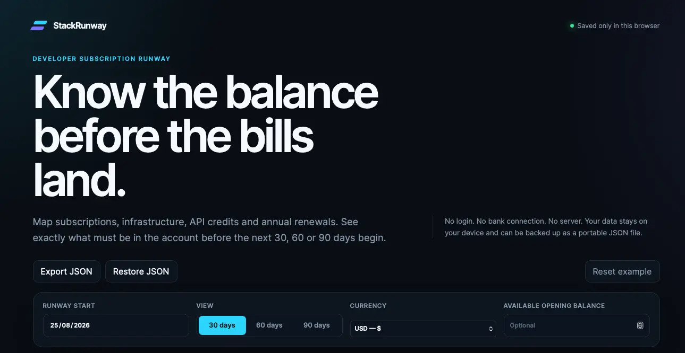

<div align="center">

# StackRunway

### Know the balance before the bills land.

**Free · private · local-first · one file**

[Open StackRunway](https://skylab008.github.io/StackRunway/) · [Download the HTML](index.html) · [Fork your own copy](https://github.com/Skylab008/StackRunway/fork)

</div>

---



Developer expenses rarely arrive in a neat monthly bundle. Hosting renews on Tuesday. API credits run out on Friday. Three annual tools land in the same week and the account balance that looked comfortable suddenly is not.

**StackRunway answers the question ordinary expense trackers miss:**

> How much must be in the bank before the runway begins?

Add subscriptions, infrastructure, API credits, domains and renewals. Choose 30, 60 or 90 days. StackRunway works through the actual billing dates and gives you one clear answer:

> **You need $684.20 in this account on 1 September to cover every scheduled development expense through 30 November.**

## Your runway at a glance

StackRunway reveals the minimum opening balance, the most expensive week, annual costs hiding behind monthly affordability, the first projected funding gap and the exact effect of pausing a subscription.

This is not another dashboard that tells you what you spent last month. It helps protect the next deployment before the charges arrive.

## Open it and start

Use the [live GitHub Pages edition](https://skylab008.github.io/StackRunway/) in any modern browser. Nothing needs to be installed and there is no account, bank connection, build command or server.

Prefer to own the file? Download [`index.html`](index.html), open it and it runs. The complete interface, styles and calculation engine live inside that single file.

## Private by design

| StackRunway does | StackRunway does not |
| --- | --- |
| Saves automatically in your browser | Send financial data to a server |
| Exports a portable JSON backup | Connect to a bank account |
| Restores your data on another device | Use analytics or trackers |
| Runs without a backend | Require a login or subscription |

Browser storage can be cleared, so **Export JSON** is the durable backup. **Restore JSON** brings the runway back whenever you need it.

## Built for real billing dates

The selected start date is day one. StackRunway projects each active expense from its next billing date across the chosen 30, 60 or 90-day horizon. Weekly, fortnightly, monthly, quarterly, annual and one-off expenses are supported. Month-end billing stays on the last valid day when a later month is shorter.

Pausing an expense removes it from the active calculation without deleting it, making cancellation decisions visible before they are made.

## Take it, fork it, improve it

```bash
git clone https://github.com/Skylab008/StackRunway.git
cd StackRunway
open index.html
```

StackRunway is an open-source gift to developers dealing with subscription sprawl and uneven billing cycles. Fork it, adapt it for your stack or send back an improvement through a pull request.

Useful software does not always need a gate, a funnel or another subscription.

## Created and released by

[Ashe Davis](https://github.com/Skylab008), an independent SaaS builder creating practical tools at the intersection of software, publishing and creative work.

Released under the [MIT Licence](LICENSE).

[Contributing](CONTRIBUTING.md) · [Security](SECURITY.md) · [Code of Conduct](CODE_OF_CONDUCT.md) · [Changelog](CHANGELOG.md)

<sub>Planning estimates only. StackRunway does not predict taxes, exchange-rate movements, price changes or usage-based overages.</sub>
